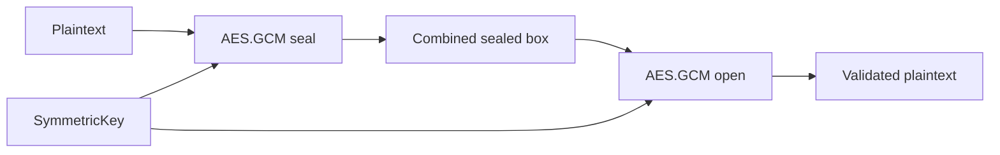

# Swift Crypto Lab

> Auditable Apple-platform experiments for secure cryptographic composition.

 

## Mission

Understand how to use platform cryptography correctly without inventing custom algorithms.

### Principles

```text
use vetted primitives
authenticate encrypted data
keep keys out of source control
treat nonce discipline as a requirement
never log secrets
document assumptions
```

## Included experiment

`CryptoEnvelope` demonstrates authenticated encryption with `AES.GCM` using CryptoKit. The example generates an ephemeral key at runtime and intentionally contains no embedded secrets.

### Data flow



## Run tests

```bash
swift test
```

## Security notes

- This is educational sample code, not a complete key-management system.
- Production key storage must be designed separately.
- Do not reuse keys or copy sample architecture blindly without a threat model.

## Scope

Defensive, educational and authorized research only.

© 2026 Fran Gonzas